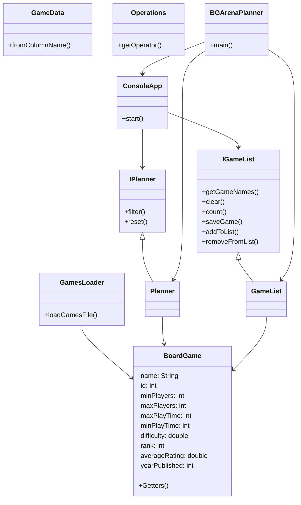
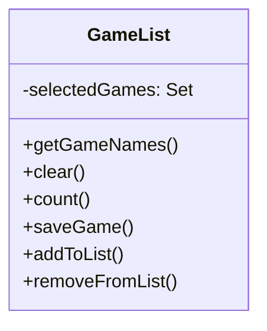
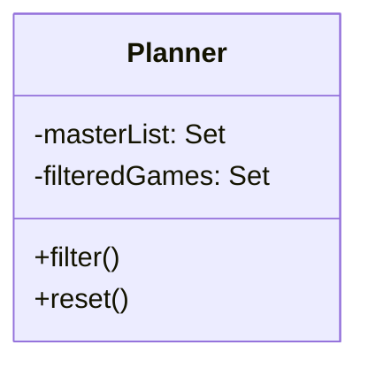
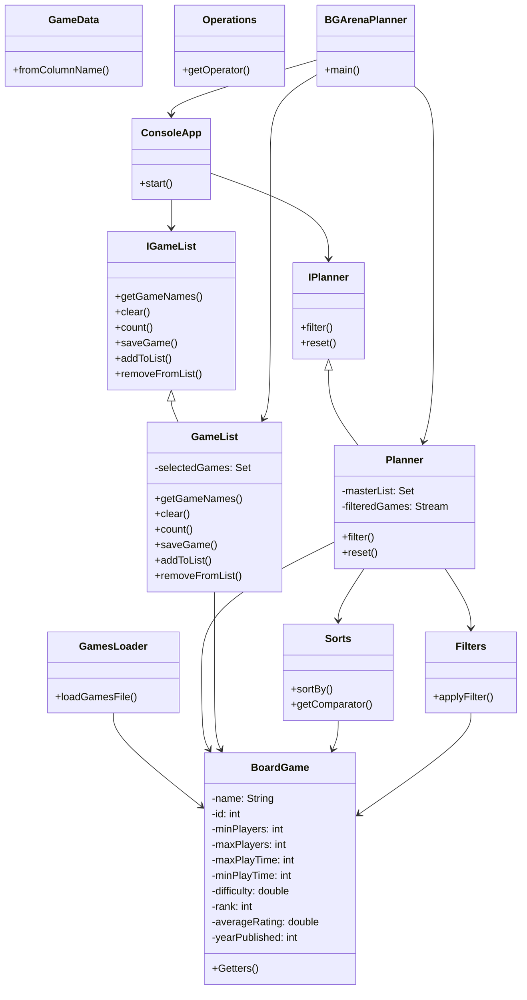

# Board Game Arena Planner Design Document

This document is meant to provide a tool for you to demonstrate the design process. You need to work on this before you code, and after have a finished product. That way you can compare the changes, and changes in design are normal as you work through a project. It is contrary to popular belief, but we are not perfect our first attempt. We need to iterate on our designs to make them better. This document is a tool to help you do that.

## (INITIAL DESIGN): Class Diagram 

Place your class diagrams below. Make sure you check the file in the browser on github.com to make sure it is rendering correctly. If it is not, you will need to fix it. As a reminder, here is a link to tools that can help you create a class diagram: [Class Resources: Class Design Tools](https://github.com/CS5004-khoury-lionelle/Resources?tab=readme-ov-file#uml-design-tools)

### Provided Code

Provide a class diagram for the provided code as you read through it.  For the classes you are adding, you will create them as a separate diagram, so for now, you can just point towards the interfaces for the provided code diagram.

### Your Plans/Design

Create a class diagram for the classes you plan to create. This is your initial design, and it is okay if it changes. Your starting points are the interfaces. 

## (INITIAL DESIGN): Tests to Write - Brainstorm

Write a test (in english) that you can picture for the class diagram you have created. This is the brainstorming stage in the TDD process. 

> [!TIP]
> As a reminder, this is the TDD process we are following:
> 1. Figure out a number of tests by brainstorming (this step)
> 2. Write **one** test
> 3. Write **just enough** code to make that test pass
> 4. Refactor/update  as you go along
> 5. Repeat steps 2-4 until you have all the tests passing/fully built program

You should feel free to number your brainstorm. 

### Planner Tests
1. Filtering by name (name == "Go").
2. Filtering by minimum players (minPlayers > 2).
3. Filtering by difficulty (difficulty <= 6.5).
4. Filtering with multiple conditions (minPlayers > 2, maxPlayers < 5).
5. Resetting filters (reset()).

### GameList Tests
1. Adding one game by name.

2. Adding multiple games using a range (e.g., 1-3).

3. Removing a game.

4. Ensuring no duplicate games.

5. Saving and loading the list from a file.

## (FINAL DESIGN): Class Diagram

Go through your completed code, and update your class diagram to reflect the final design. Make sure you check the file in the browser on github.com to make sure it is rendering correctly. It is normal that the two diagrams don't match! Rarely (though possible) is your initial design perfect. 

For the final design, you just need to do a single diagram that includes both the original classes and the classes you added. 

> [!WARNING]
> If you resubmit your assignment for manual grading, this is a section that often needs updating. You should double check with every resubmit to make sure it is up to date.

## (FINAL DESIGN): Reflection/Retrospective

> [!IMPORTANT]
> The value of reflective writing has been highly researched and documented within computer science, from learning to information to showing higher salaries in the workplace. For this next part, we encourage you to take time, and truly focus on your retrospective.

Take time to reflect on how your design has changed. Write in *prose* (i.e. do not bullet point your answers - it matters in how our brain processes the information). Make sure to include what were some major changes, and why you made them. What did you learn from this process? What would you do differently next time? What was the most challenging part of this process? For most students, it will be a paragraph or two.

## Reflection
Throughout this project, the design evolved significantly as I implemented and tested various components.            Initially, Ifocused on a basic structure, but as I progressed, we realized the need for additional utility classes such as `Sorts` and `Filters` to ensure a modular and scalable design.            The introduction of these classes helped me apply the strategy pattern, allowing for flexible sorting and filtering of board games without modifying the core logic of `Planner`.

One of the major changes in my design was the refinement of `Planner` to integrate `Sorts` and `Filters` seamlessly.            Initially, filtering and sorting logic were considered part of `Planner`, but I quickly realized that separating concerns would make our code more maintainable and reusable.            Another significant improvement was ensuring that `GameList` handled game storage efficiently while preventing duplicate entries.

Through this process, I learned the importance of iterative design and the value of writing tests first.            Implementing tests early helped us catch edge cases and refine my logic before fully integrating components.            Additionally, debugging and resolving dependency issues reinforced my understanding of Java Streams and exception handling.

If I was to approach this project again, I would likely spend more time upfront designing a clearer structure to minimize refactoring later.            While refactoring is a natural part of development, having a well-defined plan early on could have reduced the number of modifications needed.            The most challenging part of this process was ensuring all components interacted correctly, particularly when integrating `Planner` with `Sorts` and `Filters`.            Debugging issues related to Java Streams and lambda expressions also required careful attention.